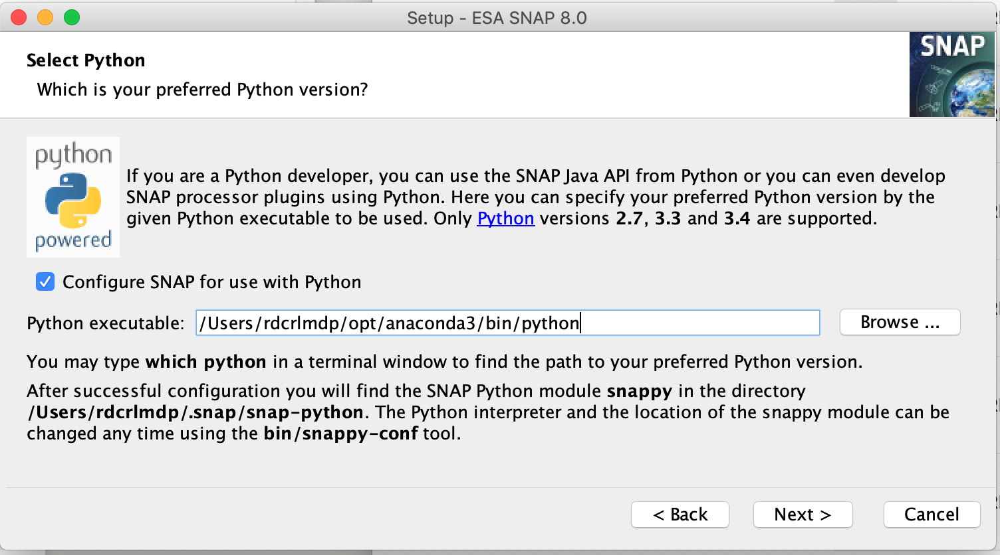

## Goal:
Provide a collection of python tools for downloading and processing SAR data for use in sea ice applications.

## Installation:

This package is built in python and relies heavily on the python interface to the Snap tool for processing Sentinel data.

#### Step 1: SNAP Installation
1. Download the installer from the [SNAP website](http://step.esa.int/main/download/snap-download/)
2. Figure out the full path to your favorite python executable.  In the terminal, run
```bash
which python
```
3. Run the SNAP installer, making sure to set the correct python path when the installer asks for it.  On my machine, it looks like this:




#### Step 2: Set environment variables
Coming soon...

## Examples:
See examples folder.
